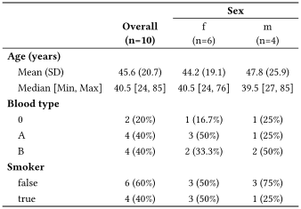
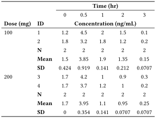
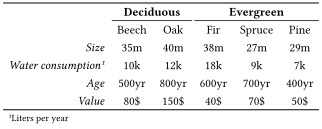

# SummaryTables.jl


<div align="center">
    <picture>
      
    </picture>
</div>

[](https://pumasai.github.io/SummaryTables.jl/stable/)
[](https://pumasai.github.io/SummaryTables.jl/dev/)

SummaryTables.jl is a Julia package for creating publication-ready
tables in HTML, docx, LaTeX and Typst formats. Tables are formatted in a
minimalistic style without vertical lines.

SummaryTables offers the `table_one`, `summarytable` and `listingtable`
functions to generate pharmacological tables from Tables.jl-compatible
data structures, as well as a low-level API to construct tables of any
shape manually.

## Examples

``` julia
data = DataFrame(
    sex = ["m", "m", "m", "m", "f", "f", "f", "f", "f", "f"],
    age = [27, 45, 34, 85, 55, 44, 24, 29, 37, 76],
    blood_type = ["A", "0", "B", "B", "B", "A", "0", "A", "A", "B"],
    smoker = [true, false, false, false, true, true, true, false, false, false],
)

table_one(
    data,
    [:age => "Age (years)", :blood_type => "Blood type", :smoker => "Smoker"],
    groupby = :sex => "Sex",
    show_n = true
)
```



``` julia
data = DataFrame(
    concentration = [1.2, 4.5, 2.0, 1.5, 0.1, 1.8, 3.2, 1.8, 1.2, 0.2,
        1.7, 4.2, 1.0, 0.9, 0.3, 1.7, 3.7, 1.2, 1.0, 0.2],
    id = repeat([1, 2, 3, 4], inner = 5),
    dose = repeat([100, 200], inner = 10),
    time = repeat([0, 0.5, 1, 2, 3], 4)
)

listingtable(
    data,
    :concentration => "Concentration (ng/mL)",
    rows = [:dose => "Dose (mg)", :id => "ID"],
    cols = :time => "Time (hr)",
    summarize_rows = :dose => [
        length => "N",
        mean => "Mean",
        std => "SD",
    ]
)
```



``` julia
categories = ["Deciduous", "Deciduous", "Evergreen", "Evergreen", "Evergreen"]
species = ["Beech", "Oak", "Fir", "Spruce", "Pine"]
data = rand(4, 5)
labels = ["", "", "Size", Annotated("Water consumption", "Liters per year"), "Age", "Value"]

body = [
    Cell.(categories, bold = true, merge = true, border_bottom = true)';
    Cell.(species)';
    Cell.(data)
]

Table(hcat(
    Cell.(labels, italic = true, halign = :right),
    body
))
```



## Comparison with PrettyTables.jl

[PrettyTables.jl](https://github.com/ronisbr/PrettyTables.jl/) is a
well-known Julia package whose main function is formatting tabular data,
for example as the backend to
[DataFrames.jl](https://github.com/JuliaData/DataFrames.jl).
PrettyTables supports plain-text output because it is often used for
rendering tables to the REPL, however this also means that it does not
support merging cells vertically or horizontally in its current state,
which is difficult to realize with plain text.

In contrast, SummaryTables’s main purpose is to offer convenience
functions for creating specific scientific tables which are out-of-scope
for PrettyTables. For our desired aesthetics, we also needed low-level
control over certain output formats, for example for controlling cell
border behavior in docx, which were unlikely to be added to PrettyTables
at the time of writing this package.
